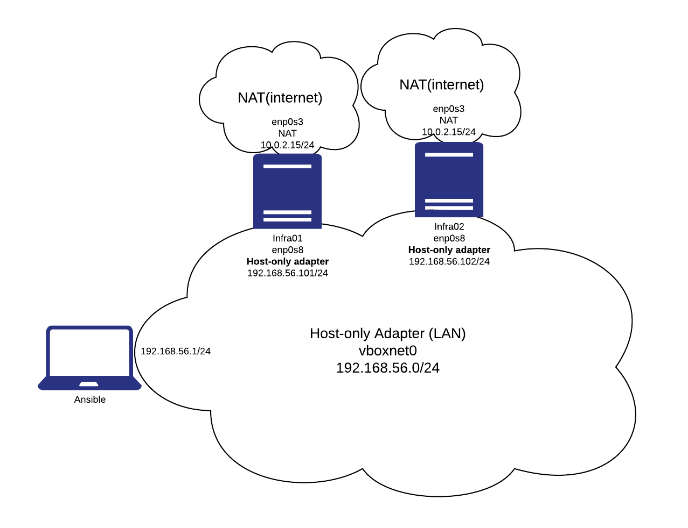

## Small manual how to setup network for VMs

Every VM should have 2 interfaces. VM settings > Network:  
- Adapter1
  - NAT
- Adapter2 -
  - Host-only adapter (vboxnet0)

You should create vboxnet0 in advance:  
File > Host network manager > Create

VM should have 2 interfaces if you execute "ip a":
- enp0s3 (NAT)
- enp0s8 (Host-only adapter)

enp0s3 is up by default, no action needed. It will be used for internet access only  
enp0s8 is down by default. It will be used for Host-VM communications. You have to configure it and assign some ip address using Netplan, check Netplan.io for examples or first task in lab5 inside this repo.

