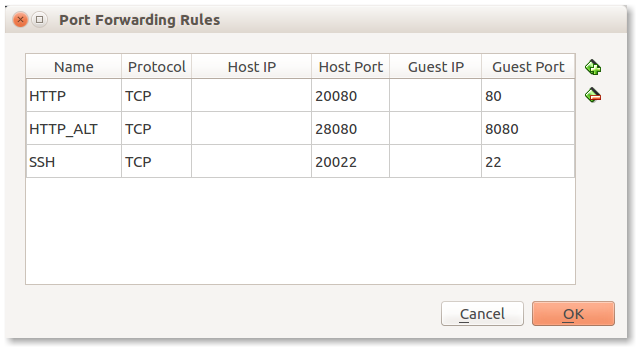

# Lab 3

## Task

Create Ansible configuration file and set default inventory file location.

Install and configure Apache HTTPd with PHP module on managed host.

Requirements:
 - Apache version should be 2.4
 - Default Apache welcome page (static) should be served from web server port 80
 - PHP info page (dynamic) should be served from web server port 8080
 - All of the above should be set up with one Ansible playbook `webserver.yml`

Expected files in your Git repository:
 - `lab03/ansible.cfg`
 - `lab03/hosts`
 - `lab03/webserver.yml`

May add more files as needed.

## Acceptance test

This **exact** command run once in your lab directory should install and
configure all the required services:

    ansible-playbook webserver.yml

## Things you (probably) need to do

 1. Install Apache. By default it can only serve static documents (not dynamic).
 2. Update Apache configuration to listen on custom port (8080) -- by default
    Apache will only listen on port 80.
 3. Add Apache `VirtualHost` configuration to serve static files from port 8080.
 4. Install PHP module for Apache so that it could use PHP to generate documents
    dynamically.

## Hints

Complete one step at a time:
 - Install Apache, verify that it works
 - Then update the Apache configuration file, verify that it works
 - And so on

If your VirtualBox instace networking configuration is `NAT`, make sure to
forward needed ports from your local machine -- this will make testing much
simpler, example:

Once done, you can access the web server from your local machine:
 - http://localhost:20080
 - http://localhost:28080

You may use `init` playbook from previous lab for initial service setup.

Use standard OS package repositories to install packages if possible:
https://packages.ubuntu.com/

Default Apache welcome page is already there if you installed Apache from APT
package; it can be found in `/var/www/html/index.html`.

Apache web server configuration files can be found in `/etc/apache2/`.

Default web site configuration file can be found in
`/etc/apache2/sites-enabled/000-default.conf`. You don't probably need to modify
this but can use it as an example when creating your own configurations.

Ports that Apache is listening on can be configured in `/etc/apache2/ports.conf`
file.

Apache configuration file change requires Apache restart. Sometimes reload would
be enough, but if unsure, do restart -- _for this lab tasks_.

Simplest possible PHP info page:

    <?php phpinfo(); ?>

Run Ansible with `--diff` (or `-D`) key to show actual changes happening to
files on server.

Useful Ansible modules: `apt`, `copy`, `service`.
