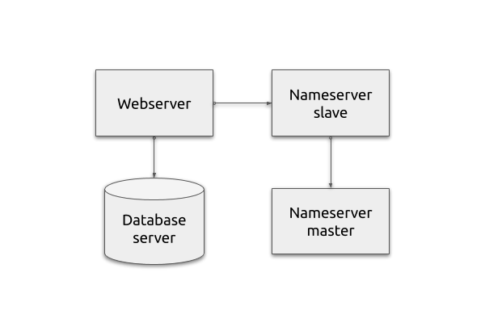

# Lab 6

## Current infrastructure



## Task

Describe backup approach for all services in your information system:
 - Web servers
 - Database servers
 - DNS servers
 - Ansible repository

Provide these documents:
 1. Backup SLA
 2. Backup restore plan

Write Ansible playbook `backup_agent` that
 1. Creates system user `backup` on VM1

Write Ansible playbook `backup_server` that
 1. Creates system user `backup` on VM2 (backup server)
 2. Sets up SSH connection from VM1 to VM2 for user `backup`
 3. Creates directory `/srv/backup` on backup server
 4. Ensure backup directory is readable and writable for `backup` user

_(only prepare the server so far, we will deal with actual backup implementation next time)_

Expected files in your Git repository:
 - `lab6/backup-sla.md`
 - `lab6/backup-restore-plan.md`
 - `lab6/backup_agent.yml`
 - `lab6/backup_server.yml`

Feel free to add more files as needed.

**Note:** only `.md`, `.txt` or `.pdf` files are accepted as documents!


## Acceptance test

This command run once in your lab directory should install and configure all the
required services:

    ansible-playbook backup_server.yml


## Hints

You already have configured SSH key-based access in [Lab 2](../lab2). Approach in this lab is similar, but note that this time you need to set up access from one managed server to another.

You will need to propagate `backup` user public SSH key from VM1 (`backup/.ssh/id_rsa.pub`) to VM2 (`backup/.ssh/authorized_keys`). Easiest way to do it is
 - Pre-generate the keypair on your Ansible machine
 - Upload both private and public key to VM1
 - Upload public key to VM2

There are other solutions as well. Whatever works for you is fine.

You can use this command to verify that `backup` user has needed access to backup directory

```
sudo -u backup touch /srv/backup/test.txt
```

Check lecture slides for ideas what to list in SLA and restore plan.

If you are missing some information to complete backup documentation (list of IT staff, amount of data, value of information, acceptable data loss) -- make it up! Be creative, but try to keep it adequate and somewhat related to real life.
