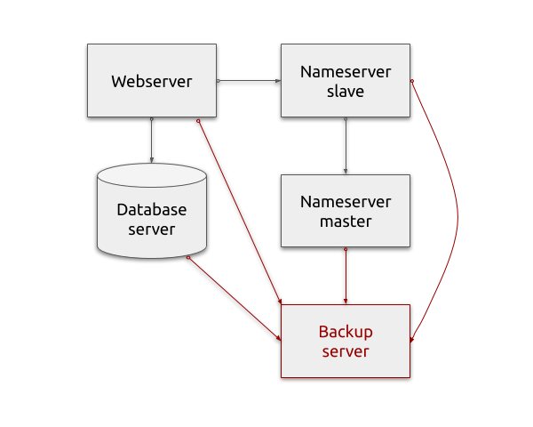

# Lab 6

## Current infrastructure

Task 1 was on [previous lab](task-1.md).

## Task 2

First, let's get out project setup right. Since now on, we expect any lab
directory on you Git repo to contain these files:
 - `ansible.cfg`
 - `hosts`
 - `init.yml`

`ansible.cfg` contains Ansible configuration for this project; check
[lab 3](../lab3) for details. Minimal contents of this file should be:
 - [inventory file location](https://docs.ansible.com/ansible/latest/reference_appendices/config.html#default-host-list)
 - [vault password file location](https://docs.ansible.com/ansible/latest/reference_appendices/config.html#default-vault-password-file)

`hosts` contains your infrastructure inventory; all hosts needed for this lab
should be listed there.

`init.yml` is the playbook for initial host setup; check [lab 2](../lab2) for
details. It should:
 - Key based SSH access to all the servers listed in `hosts` file
 - Passwordless `sudo` on all the serves listd in the `hosts` file
 - Correct networking setup where applicable: Netplan etc.

It is allowed to run `init.yml` playbook with `--ask-pass` and
`--ask-become-pass` parameters. 

**It is NOT allowed to run any other playbooks with any of `--ask-*`
parameters!**

## Task 3

Following your backup documentation from the, set up actual working backups for
services deployed so far:
 - Webserver
 - Database server
 - DNS master
 - DNS slave
 - Backup server itself
 - Ansible repo

It is okay to update the documentation as well if you feel need.

**Coverage:** if some of the services doesn't need to be backed up, skip it --
but make sure that your backup documents explain
 - why backup is not needed for that service, and
 - how to restore it in case of disaster recovery

**Frequency:** backups should be scheduled to run as defined in the backup SLA
document.

**Retention:** backups should be preserved for at least as long as defined in
the backup SLA document. Automatic cleanup of old backup is not required in this
task.

**Usability:** steps described in backup restore plan should work as described.
It is okay to restore backups manually in this task.

**Storage:** all the data needed to restore all the services must be preserved
in at least 2 copies on two different hosts, for example, running MySQL server
itself and MySQL dump on a backup server.

## Expected solution

Expected files in your Git repository:
 - `lab6/ansible.cfg`
 - `lab6/hosts`
 - `lab6/init.yml`
 - `lab6/backup-sla.md` -- from previous lab, updated if needed
 - `lab6/backup-restore-plan.md` -- from previous lab, updated if needed
 - `lab6/backup_server.yml` -- from previous lab, updated if needed
 - `lab6/dns.yml` -- copied from [lab 5](../lab5) and modified (backup agent set
    up) as needed
 - `lab6/wordpress.yml` -- copied from [lab 4](../lab4) and modified (backup
    agent set up) as needed

Feel free to add more files as needed.

**Note:** only `.md`, `.txt` or `.pdf` files are accepted as documents!

## Acceptance test

These command run once in your lab directory should install and configure all
the required services:

    ansible-playbook backup_server.yml
    ansible-playbook dns.yml
    ansible-playbook wordpress.yml

## Hints

Example `ansible.cfg` file:

    [defaults]
    inventory = hosts
    vault_password_file = $HOME/.ansible_vault_password

You have a working solution to SSH from one server to another, check the
`backup_agent` playbook from the previous lab. Use this, and commands from the
[demo](demo.md) to set up the backup creation.

If in doubt, use Crontabs to schedule backups; there are examples in the demo.
